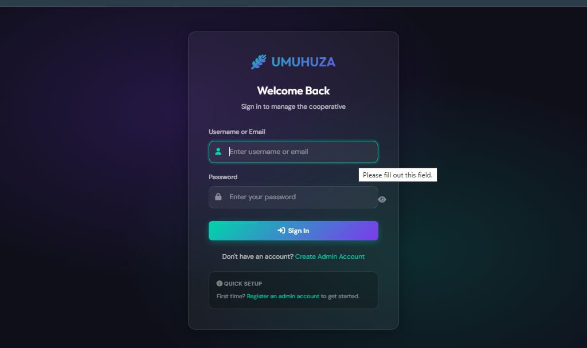
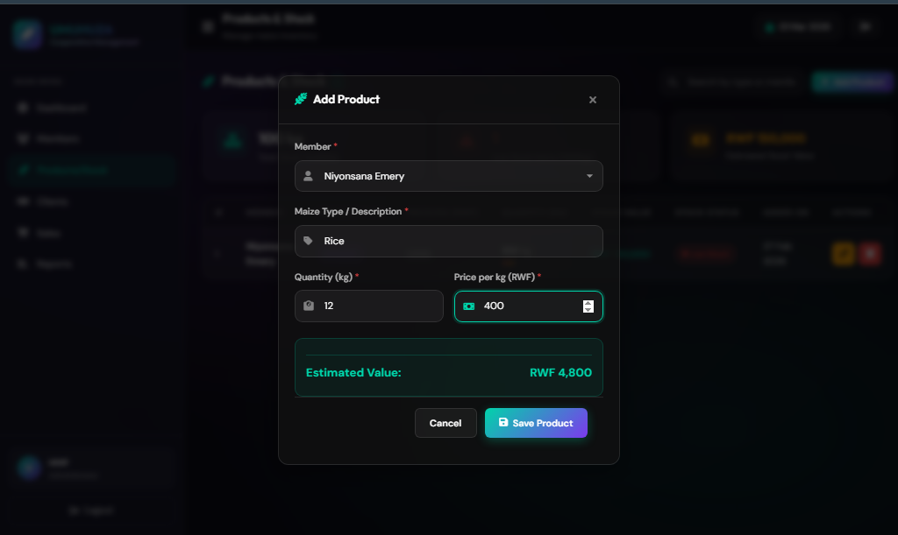
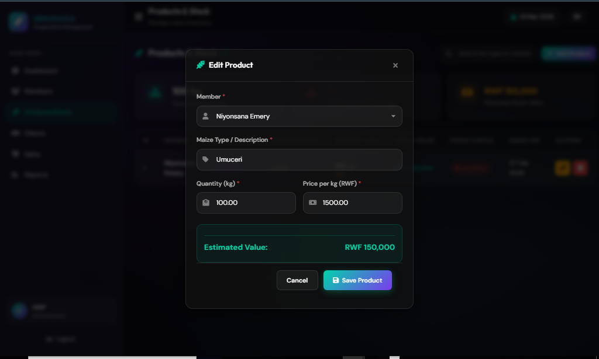
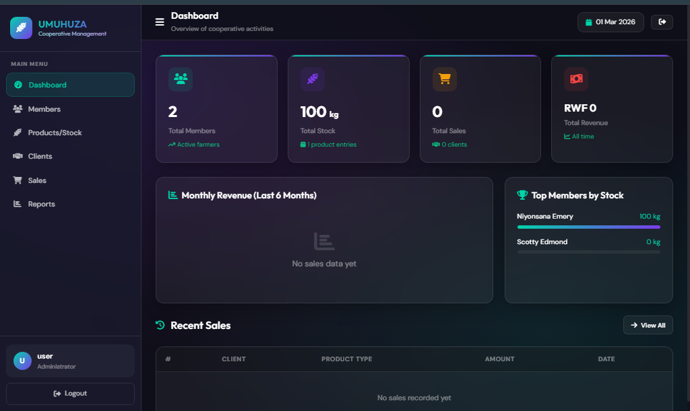
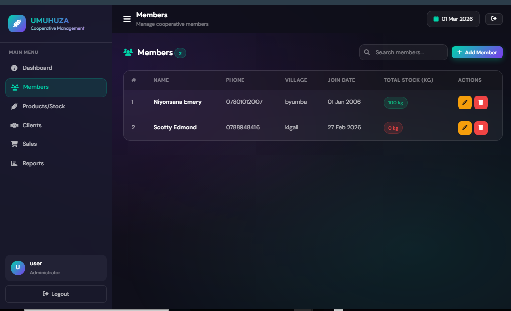
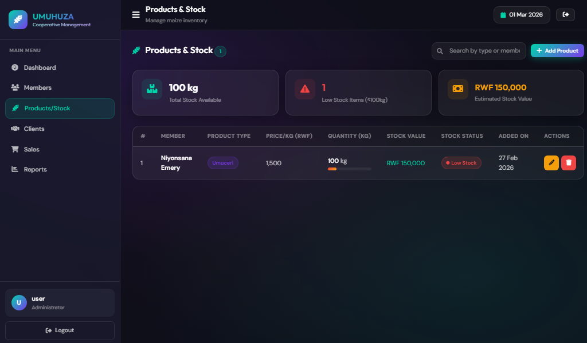
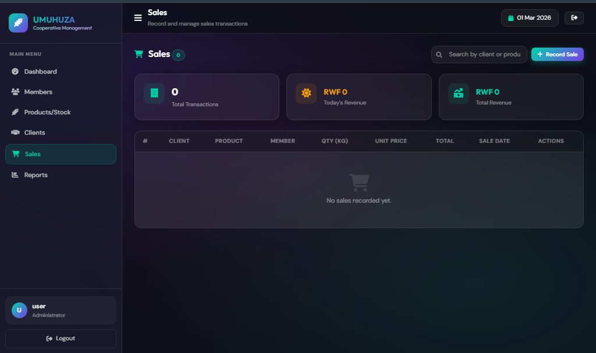

# 🚀 UMUHUZA COOPERATIVE  
### Modern Cooperative Management Web Application  

---

## 📌 Overview

**UMUHUZA Cooperative** is a modern web-based management system designed to help cooperatives efficiently manage:

- 👥 Members  
- 📦 Products  
- 🧾 Sales  
- 👤 Clients  
- 📊 Reports  

Built with **PHP (PDO)** and **MySQL**, it focuses on security, performance, and user-friendly design.

---

# 🖼️ Application Screenshots

> 📸 Replace the image links below with your actual screenshots inside a `/screenshots` folder.

## 🔐 Login Page

##  Recent page

##  Edit page

## 📊 Dashboard

## 👥 Members Management

## 📦 Products Management

## 🧾 Sales Module

---

# ✨ Core Features

## 🔑 Authentication System
- Secure Registration & Login
- Password hashing (BCRYPT)
- Session-based authentication
- Session ID regeneration
- Logout functionality

## 👥 Members Management
- Full CRUD operations
- Search & Pagination
- Member contribution tracking

## 📦 Products Management
- Full CRUD
- Real-time stock tracking
- Stock status indicators

## 👤 Clients Management
- Full CRUD
- Purchase history tracking

## 🧾 Sales System
- Create, update & delete sales
- Automatic total calculation
- Automatic stock deduction
- Linked client & product records

## 📊 Reports Module
- Sales reports (date filter)
- Stock reports
- Member contributions report

---

# 🔐 Security Features

✔ Passwords hashed using `password_hash()`  
✔ PDO Prepared Statements (SQL Injection Protection)  
✔ XSS protection with `htmlspecialchars()`  
✔ Secure session handling  
✔ Delete confirmation prompts  
✔ Foreign Key constraints for data integrity  

---

# 🗂️ Project Structure
